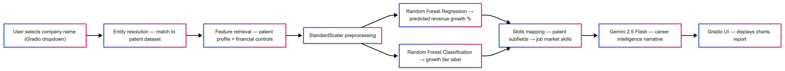

# Agentic Evolution: AI Adoption Intensity and Market Concentration

Agentic Evolution is a research and deployment project that quantifies firm-level AI adoption intensity, links innovation behavior to market concentration dynamics, and translates those signals into practical career intelligence. The system integrates patent data, financial indicators, and labor-market skill signals to model how companies are investing in AI, predict growth characteristics, and generate actionable guidance through an interactive application.

## Research Question

How does AI adoption intensity—measured through patent breadth, subfield concentration, and firm-level innovation activity—relate to market concentration outcomes, and how can these patterns be operationalized into useful career insights for job seekers?

## Dataset Sources

- **USPTO AIPD (AI Patent Dataset):** AI patent activity, technical subfields, and innovation footprints.
- **Compustat:** Firm-level financial and accounting indicators used for growth and market structure analysis.
- **LinkedIn (skills signal):** Workforce and job-market skill trends used to map technical subfields to demand-oriented competencies.

## Project Structure

```text
agentic_evolution/
├── src/            # Core pipeline modules (artifacts, prediction, skills, RAG, agent orchestration)
├── models/         # Trained models and metadata artifacts
├── data/           # Input datasets and engineered data files
├── app.py          # Gradio app entry point for Career Intelligence tool
└── notebooks/      # Phase notebooks (EDA, modeling, and deployment walkthrough)
```

### Pipeline architecture overview:
1. User selects company name (Gradio dropdown)
2. Entity resolution — match to patent dataset (src/predict.py)
3. Feature retrieval — patent profile + financial controls
4. StandardScaler preprocessing (models/preprocessor.pkl)
5. Random Forest Regression → predicted revenue growth %
6. Random Forest Classification → growth tier label
7. Skills mapping — patent subfields → job market skills (src/skills_mapping.py)
8. Gemini 2.5 Flash — career intelligence narrative (src/rag.py)
9. Gradio UI — displays charts, skills, market context, report.  
***visual architecture diagram***  
<p align="center">
  
</p>


## Setup Instructions

### 1) Clone the repo and create a Python environment
``` 
git clone {repository_url}
```
```bash
cd agentic_evolution
```
```bash
python -m venv .venv
source .venv/bin/activate
```

### 2) Install dependencies and download models/datasets

```bash
pip install -r requirements.txt
pip install google-genai python-dotenv requests
```
**Note: only download the datasets and models if they are not included in the repo. If they are already included, you can skip the download step.**
> Download the dataset from [Google Drive link](https://drive.google.com/drive/folders/1DR6e1qrWz8w0f9tRXmeHHgBL2qxH_Gku?usp=sharing)
   and place in `data/`.  
> Download the models from [Google Drive link](https://drive.google.com/drive/folders/1swl98sLUuHqy-_k5h9tAQPiNWMtNLfSP?usp=sharing)
   and place in `models/`

### 3) Configure environment variables

Create a `.env` file in the project root:

```env
GEMINI_API_KEY=your_gemini_api_key_here
```

### 4) Run the Gradio app

```bash
python app.py
```

### 5) Optional: Run module checks

```bash
python -m src.predict
python -m src.rag
```

## Phase Overview

- **Phase 2 — EDA:** Data integration, descriptive analytics, patent-subfield exploration, and early labor-market signal analysis.
- **Phase 3 — Models:** Feature engineering, predictive modeling, AI intensity scoring, and model artifact packaging.
- **Phase 4 — Deployment:** Agent orchestration, retrieval-augmented insight generation, and Gradio-based user interface.

## Team
**DTSC-5082**  
**University of North Texas (UNT)**  
**Group 8**:
- **Akhil Sai Yalavarthi**
- **Etsub Feleke**
- **Hoda Malak**
- **Sreekanth Taduru**

## **References:**
- United States Patent and Trademark Office. (2023). *Artificial Intelligence Patent Dataset (AIPD), 2023 Edition.* https://www.uspto.gov/ip-policy/economic-research/research-datasets/artificial-intelligence-patent-dataset

- PatentsView. (2023). *PatentsView Patent Data.* https://patentsview.org/download/data-download-tables

- S&P Global Market Intelligence. (2024). *Compustat North America Annual Fundamentals.* Wharton Research Data Services.https://wrds-www.wharton.upenn.edu/

- Xanderios. (2024). *LinkedIn Job Postings Dataset.* HuggingFace.https://huggingface.co/datasets/xanderios/linkedin-job-postings

- Google. (2025). *Gemini 2.5 Flash.* Google AI for Developers.
https://ai.google.dev/

- Babina, T., Fedyk, A., He, A., & Hodson, J. (2024). Artificial intelligence, firm growth, and product innovation. *Journal of Financial Economics, 151*, 103745. https://doi.org/10.1016/j.jfineco.2024.103745