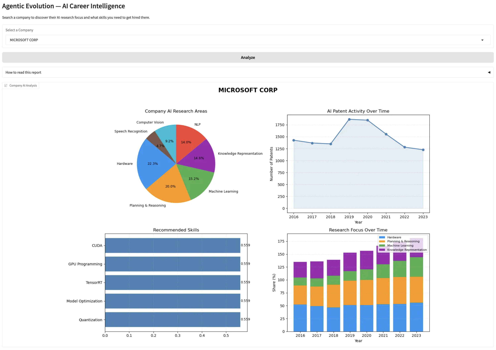

# Agentic Evolution: AI Adoption Intensity and Market Concentration

Agentic Evolution is a research and deployment project that quantifies firm-level AI adoption intensity, links innovation behavior to market concentration dynamics, and translates those signals into practical career intelligence. The system integrates patent data, financial indicators, and labor-market skill signals to model how companies are investing in AI, predict growth characteristics, and generate actionable guidance through an interactive application.

## Research Question

How does AI adoption intensity—measured through patent breadth, subfield concentration, and firm-level innovation activity—relate to market concentration outcomes, and how can these patterns be operationalized into useful career insights for job seekers?

## Dataset Sources

- **USPTO AIPD (AI Patent Dataset):** AI patent activity, technical subfields, and innovation footprints.
- **Compustat:** Firm-level financial and accounting indicators used for growth and market structure analysis.
- **LinkedIn (skills signal):** Workforce and job-market skill trends used to map technical subfields to demand-oriented competencies.

## Project Structure

```text
agentic_evolution/
├── src/            # Core pipeline modules (artifacts, prediction, skills, RAG, agent orchestration)
├── models/         # Trained models and metadata artifacts
├── data/           # Input datasets and engineered data files
├── app.py          # Gradio app entry point for Career Intelligence tool
└── notebooks/      # Phase notebooks (EDA, modeling, and deployment walkthrough)
```

### Pipeline architecture overview:
1. User selects company name (Gradio dropdown)
2. Entity resolution — match to patent dataset (src/predict.py)
3. Feature retrieval — patent profile + financial controls
4. StandardScaler preprocessing (models/preprocessor.pkl)
5. Random Forest Regression → predicted revenue growth %
6. Random Forest Classification → growth tier label
7. Skills mapping — patent subfields → job market skills (src/skills_mapping.py)
8. Gemini 2.5 Flash — career intelligence narrative (src/rag.py)
9. Gradio UI — displays charts, skills, market context, report.  
***visual architecture diagram***  
<p align="center">
  
</p>

## Demo

### How It Works

Select a company from the dropdown and click **Analyze**. 
The app returns four outputs in one view:

1. **AI Research Areas** — pie chart of the company's 
   patent portfolio by AI category
2. **Patent Activity Over Time** — line chart showing 
   how AI investment has grown year by year
3. **Recommended Skills** — top skills to learn based 
   on the company's research focus
4. **Research Focus Over Time** — how priorities have 
   shifted across AI categories

### Screenshots

**Microsoft Corp**



### Sample Output

For **Microsoft Corp** the system returns:  
**Market Context**  
**MICROSOFT CORP** is in the Technology sector. The model classifies expected growth as Low Growth, with an AI intensity score of 0.5607 on a 0 to 1 scale. The company has 1228 AI patents in this dataset, and the most recent record is from 2023. These estimates are based on historical patent behavior and should be used as one signal among many.  
**Career Intelligence Report**  
Here is your career intelligence report for AI opportunities at **MICROSOFT CORP**:  
**MICROSOFT CORP**: AI Career Intelligence Report  
**1. What kind of AI work is this company actually doing?**  
Microsoft is deeply invested in developing core AI infrastructure and custom hardware (as evidenced by 55.9% hardware patents, like their Maia AI accelerator). This involves optimizing AI models for performance, efficiency, and scale, from edge devices to massive cloud deployments....  
**2. What are the top 5 skills a job seeker should prioritize to get hired at this company?**  
AI Hardware Optimization & Deployment (e.g., CUDA, ONNX, Quantization, Pruning): Critical for roles focusing on Microsoft's custom AI silicon and efficient model inference.....  
**3. What role titles are most likely being hired for?**
- Software Engineer, AI/ML
- Applied Scientist (AI/ML, Deep Learning, NLP, Computer Vision)
- Deep Learning Engineer
- Machine Learning Engineer  

**4. One specific career advice tip for this company.**  
Demonstrate a strong understanding of how to operationalize and optimize AI models for real-world, large-scale product integration, particularly focusing on efficiency, cost, and responsible deployment within a cloud environment like Azure. Highlighting contributions to open-source projects relevant to Microsoft's ecosystem (e.g., ONNX Runtime) or showing projects that push the boundaries of efficient AI hardware/software co-design will be a significant advantage.

### Running Locally
To run the app locally, follow the setup instructions below. This will allow you to explore the career intelligence insights for any company included in the dataset.
## Setup Instructions

### 1) Clone the repo and create a Python environment
``` 
git clone {repository_url}
```
```bash
cd agentic_evolution
```
```bash
python -m venv .venv
source .venv/bin/activate
```

### 2) Install dependencies and download models/datasets

```bash
pip install -r requirements.txt
pip install google-genai python-dotenv requests
```
**Note: only download the datasets and models if they are not included in the repo. If they are already included, you can skip the download step.**
> Download the dataset from [Google Drive link](https://drive.google.com/drive/folders/1DR6e1qrWz8w0f9tRXmeHHgBL2qxH_Gku?usp=sharing)
   and place in `data/`.  
> Download the models from [Google Drive link](https://drive.google.com/drive/folders/1swl98sLUuHqy-_k5h9tAQPiNWMtNLfSP?usp=sharing)
   and place in `models/`

### 3) Configure environment variables

Create a `.env` file in the project root:

```env
GEMINI_API_KEY=your_gemini_api_key_here
```

### 4) Run the Gradio app

```bash
python app.py
```

### 5) Optional: Run module checks

```bash
python -m src.predict
python -m src.rag
```

## Phase Overview

- **Phase 2 — EDA:** Data integration, descriptive analytics, patent-subfield exploration, and early labor-market signal analysis.
- **Phase 3 — Models:** Feature engineering, predictive modeling, AI intensity scoring, and model artifact packaging.
- **Phase 4 — Deployment:** Agent orchestration, retrieval-augmented insight generation, and Gradio-based user interface.

## Team
**DTSC-5082**  
**University of North Texas (UNT)**  
**Group 8**:
- **Akhil Sai Yalavarthi**
- **Etsub Feleke**
- **Hoda Malak**
- **Sreekanth Taduru**

## **References:**
- United States Patent and Trademark Office. (2023). *Artificial Intelligence Patent Dataset (AIPD), 2023 Edition.* https://www.uspto.gov/ip-policy/economic-research/research-datasets/artificial-intelligence-patent-dataset

- PatentsView. (2023). *PatentsView Patent Data.* https://patentsview.org/download/data-download-tables

- S&P Global Market Intelligence. (2024). *Compustat North America Annual Fundamentals.* Wharton Research Data Services.https://wrds-www.wharton.upenn.edu/

- Xanderios. (2024). *LinkedIn Job Postings Dataset.* HuggingFace.https://huggingface.co/datasets/xanderios/linkedin-job-postings

- Google. (2025). *Gemini 2.5 Flash.* Google AI for Developers.
https://ai.google.dev/

- Babina, T., Fedyk, A., He, A., & Hodson, J. (2024). Artificial intelligence, firm growth, and product innovation. *Journal of Financial Economics, 151*, 103745. https://doi.org/10.1016/j.jfineco.2024.103745